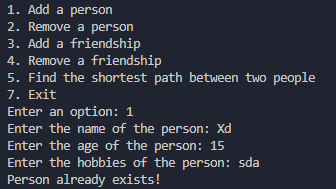

# CSE222 - HW8

## Emirhan Altune

## 200104004035

## Class Diagram

@startuml

class Person {
-name: String
-age: int
-hobbies: List<String>
-timestamp: long

+Person(name: String, age: int, hobbies: List<String>)
+getName(): String
+getAge(): int
+getHobbies(): List<String>
+getTimestamp(): long
+setName(name: String): void
+setAge(age: int): void
+setHobbies(hobbies: List<String>): void
+setTimestamp(timestamp: long): void
+toString(): String
}

class SocialNetwork {
-people: Map<String, Person>
-friends: Map<Person, List<Person>>

+SocialNetwork()
+addPerson(person: Person): boolean
+removePerson(name: String): boolean
+getPerson(name: String): Person
-addFriendship(person1: Person, person2: Person): boolean
+addFriendship(name1: String, time1: long, name2: String, time2: long): boolean
-removeFriendship(person1: Person, person2: Person): boolean
-removeFriendship(name1: String, time1: long, name2: String, time2: long): boolean
-removeAllFriendships(person: Person): void
+getFriends(person: Person): List<Person>
-shortestPath(goal: Person, previous: List<Person>): List<Person>
-shortestPath(start: Person, goal: Person): List<Person>
+shortestPath(name1: String, time1: long, name2: String, time2: long): List<Person>
-calculateScore(person1: Person, person2: Person): double
-mutualFriends(person1: Person, person2: Person): int
-mutualHobbies(person1: Person, person2: Person): int
-suggestFriends(person: Person, limit: int): void
+suggestFriends(name: String, time: long, limit: int): void
-cluster(person: Person, previous: List<Person>): List<Person>
+cluster(): void
}

class Menu {
-signalCame: boolean
-socialNetwork: SocialNetwork

+Menu()
+static main(args: String[]): void
-static printMenu(): void
-static readOption(): int
-static parseTimestamp(): long
-menuLoop(): void
-StartSignalHandler(): void
-addPerson(): void
-removePerson(): void
-addFriendship(): void
-removeFriendship(): void
-findShortestPath(): void
-suggestions(): void
-clusters(): void
}

@enduml

## Add Person

### Description

This method adds a person node to the graph. If the person is already in the graph, it should not be added again. The method should return true if the person is added successfully, and false if the person is already in the graph.

### Screenshots

#### 

Adding a person to the graph.

#### 

Trying to add a person that already exists in the graph.

## Remove Person

### Description

This method removes a person node from the graph. If the person is not in the graph, the method should return false. If the person is removed successfully, the method should return true.

### Screenshots

#### 

Removing a person from the graph.

#### 

Trying to remove a person that does not exist in the graph.

## Add Friendship

### Description

This method adds a friend connection between two people. If the people are already friends, the method should return false. If the people are not in the graph, the method should return false. If the people are not friends and they are in the graph, the method should return true. The friendship should be non-directional so if A is a friend of B, B should be a friend of A. To achieve this, we add them their friend lists at the same time.

### Screenshots

#### 

Adding a friendship between two people.

#### 

Trying to add a friendship between two people where one of them does not exist in the graph.

## Remove Friendship

### Description

This method removes a friend connection between two people. If the people are not friends, the method should return false. If the people are not in the graph, the method should return false. If the people are friends and they are in the graph, the method should return true. The friendship should be non-directional so if A is a friend of B, B should be a friend of A. To achieve this, we remove them from their friend lists at the same time.

### Screenshots

#### 

Removing a friendship between two people.

## Find Shortest Path

### Description

This method finds the shortest path between two people. If the people are not in the graph, the method should return null. If there is no path between the people, the method should return null. If the people are the same, the method should return an empty list. If there is a path between the people, the method should return a list of people starting from the first person and ending with the second person. The list should include the people themselves.

### Screenshots

#### 

Finding the shortest path between two people.

## Suggestions

### Description

This method finds the suggestions for a person. If the person is not in the graph, the method should return null. This method does not suggest friends of the person. It could suggest friends of friends or people share mutual hobbies. The method should return a list that limits by the given number. If there are not enough suggestions, the method should return what it has. It sorts the suggestions by a score that is calculated by the number of mutual friends and hobbies.

### Screenshots

#### 

Finding suggestions for a person.

## Clusters

### Description

This method finds the clusters in the graph. A cluster is a group of people that are connected to each other. The method should return a list of clusters. Each cluster should be a list of people. The clusters printed without order.

### Screenshots

#### 

Finding the clusters in the graph.
